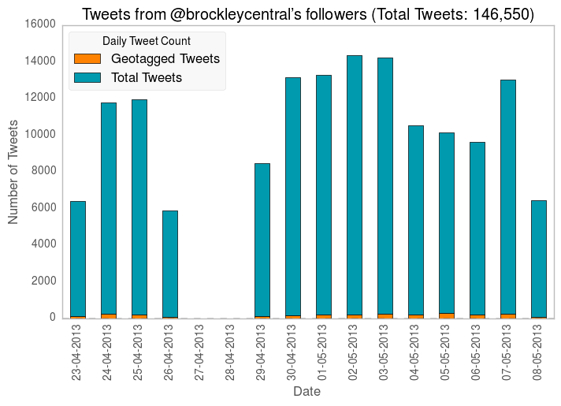

*Not intended for production use*

- Install requirements using `pip install -r requirements.txt`
- Ensure a Postgres DB called `tweetstream` exists:
    - `u`: streamer
    - `p`: streamer
- Run DB migrations using `alembic upgrade head` to create the database table and indices
- Get Twitter API credentials: https://dev.twitter.com/apps/new
- Ensure you have a `keys.py` file containing the following string variables:
    - `con_key`: the API consumer key
    - `con_secret`: the API consumer secret
    - `acc_key`: the API access key
    - `acc_secret`: the API access secret
- In `main()`, change the `to_follow` variable to the Twitter user whose followers' Tweets you wish to retrieve
- Run `python getstream.py` from the command line

If you wish to visualise the data, an [IPython notebook](http://nbviewer.ipython.org/urls/github.com/urschrei/tweetstodb/raw/master/visualise_tweets.ipynb) is provided.

For offline analysis (using dumped CSV data), run [this IPython notebook](http://nbviewer.ipython.org/urls/github.com/urschrei/tweetstodb/raw/master/visualise_tweets_csv.ipynb).

